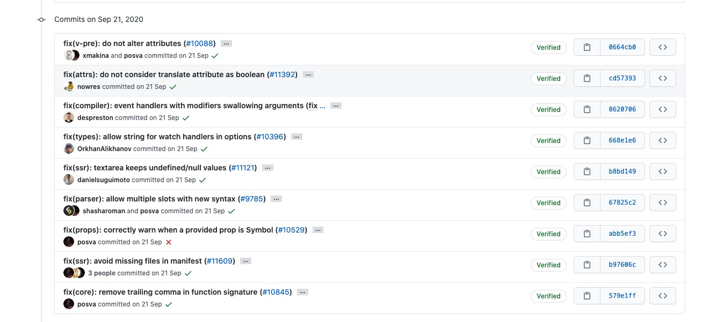
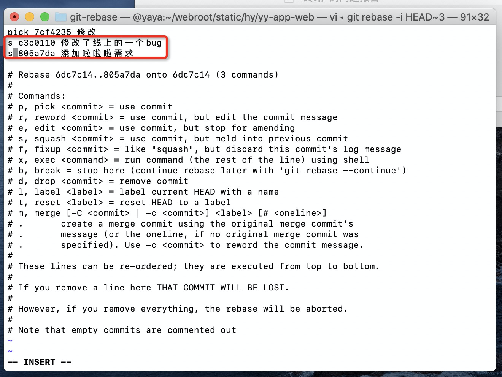
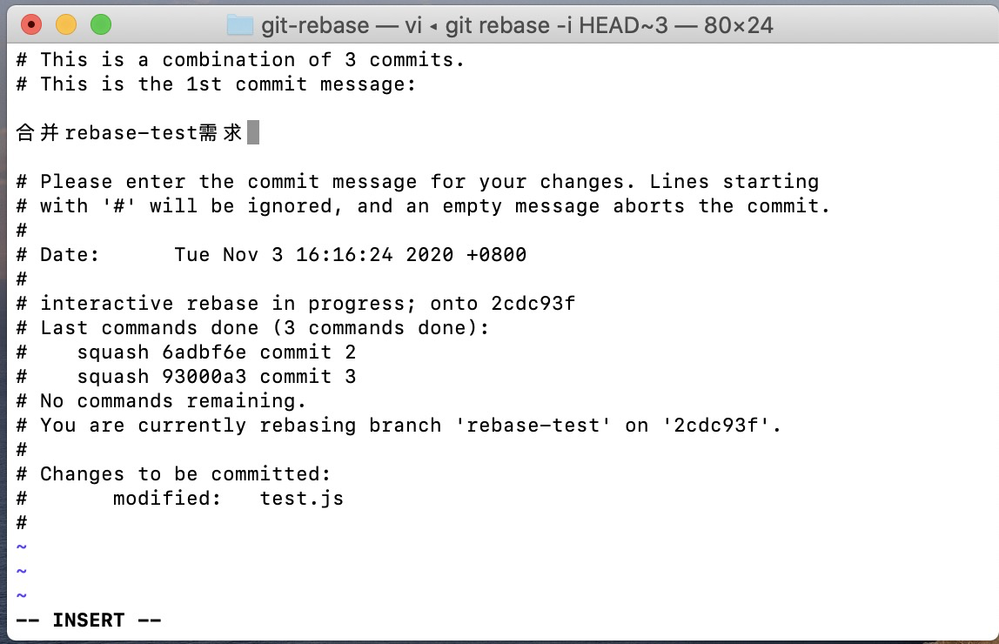
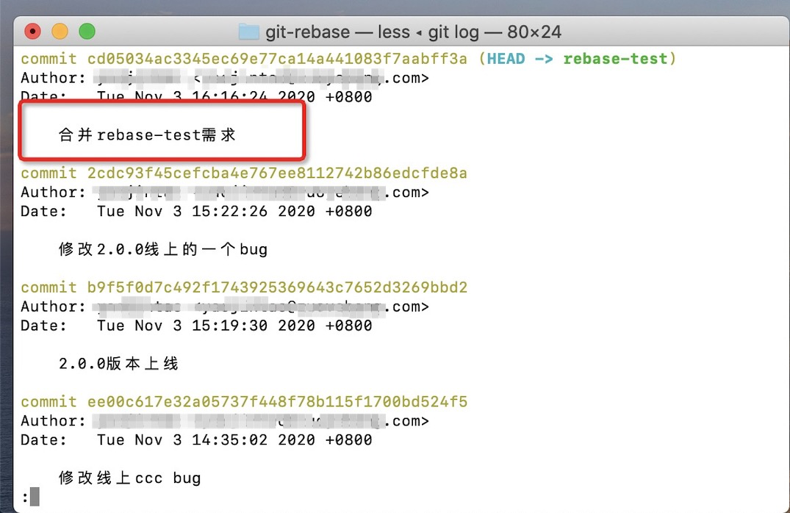
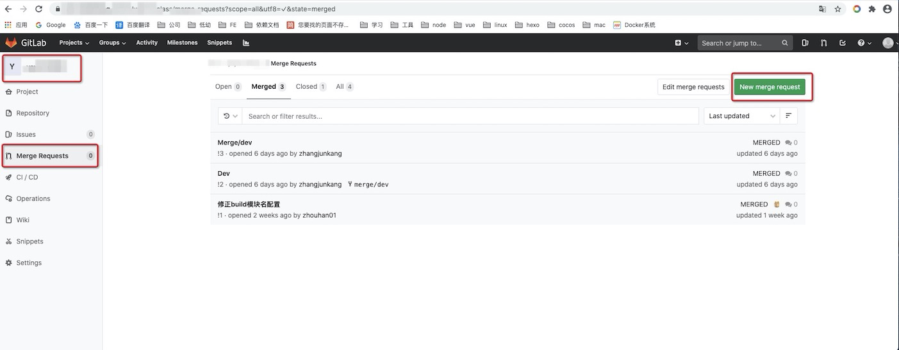
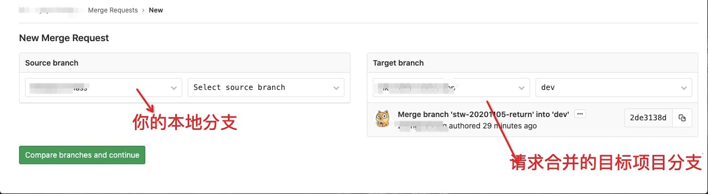
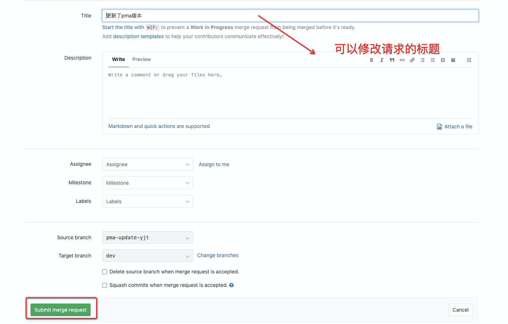
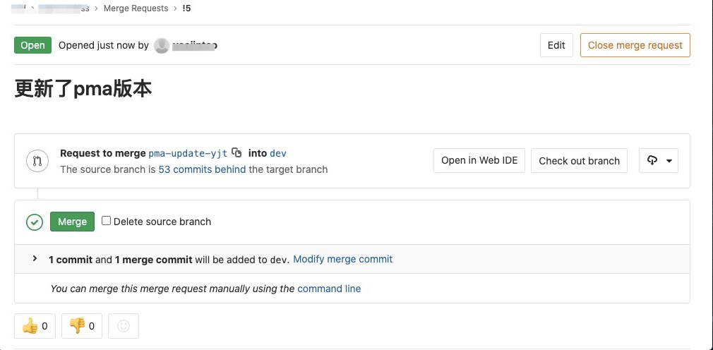

# git rebase 使用总结



> 上边是vue项目的commit记录，一个commit是一个需求或者修复一个bug，是不是感觉特别清晰

总结一下rebase相对与merge的优势所在

* 一条commit就代表一个需求，commit信息清晰

* code review或者定位问题方便

梳理一套git rebase提交的流程，方便后期使用


## 日常开发

> 日常开发流程，需求开始拉取分支--->需求开发中提交一顿提交--->需求测试完毕合并到主分支

1. 需求开始，更新主分支代码，拉取你的分支

```
git pull origin dev
git checkout -b XXX
```

2. 日常开发提交

```
git add .
git commit -m "提交注释信息"
git push origin XXX
```


## 测试完成commit合并为一条

1. 添加合并commit命令

```
方案1: git rebase -i HEAD~3 // 3代表合并commit的次数
方案2: git rebase -i commitId // git log可以显示所有commitId，这个commitId为开始合并的第一个
```

2. 进入vi编辑模式，s为合并为上一条提交



3. vi非编辑模式下dd可以删除一行。:wq 保存之后进入合并注释阶段，保留一个合并的注释



4. git log已经合并为一个commit了




## 将自己的分支rebase到最新的分支

1. 自己的分支rebase到最新的主分支

```
git fetch origin dev
git rebase dev // 如果冲突，走下边2
git push -f origin XXX // rebase 成功后，暴力推送到当前分支。不走commit
```

2. 如果在rebase主分支出现冲突

```
手动解决冲突
git add .
git rebase --continue // 剩下多余 commit，需要继续rebase
git rebase --skip // 极少数情况下，处理冲突后跳过rebase才需要
git rebase --abort  // 非必须，如果想回到之前的rebase状态可以使用
git push -f origin XXX // rebase 成功后，暴力推送到当前分支。不走commit
```


## gitlab提交merge request请求

1. 登陆gitlab选择你合并的项目>Merge Request>New merge request



2. 添加合并、合并目标的项目和分支



3. 可以修改下标题



4. 提交merge request请求后成功




## 待项目管理员同意你的合并后便会显示到dev分支的commit记录中
